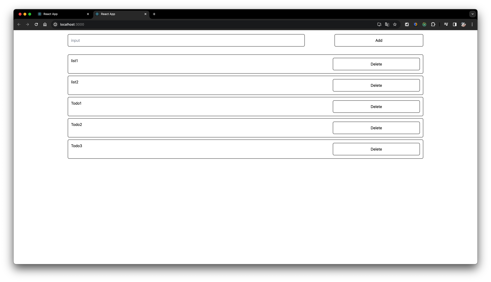

# 원티드 3월 프론트엔드 챌린지 사전과제

### 과제

- React를 이용한 Todo List
  - Todo 추가
  - Todo 삭제

### 사용한 라이브러리

- `uuid` : Todo key관리
- `tailwind` : 컴포넌트 스타일링
- `redux toolkit` : 클라이언트 상태관리

### 실행

```
yarn install
yarn start
```

### 완성화면


